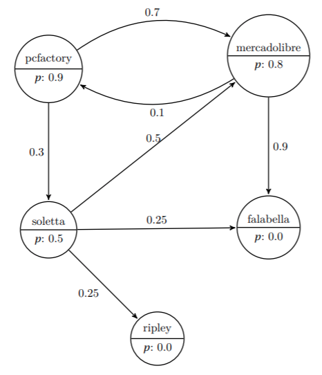

# CuakCuakGo
At this project, I had that make a program with the language C, keep reading to know more about it.
## A bit of contex
CuakCuakgo has managed to collect a lot of information regarding how users browse the web. This information was processed for getting the probability of that one user that currently is on a site web A and go a hyperlink to another site B, or of that finish his session of navigation in the same site A.
## About the command-line
All the parameters are to get like arguments of command-line. For example:
```shell
user@machine:$ ./exe <FILE> <Initial site> <Final site>
```
## The file
The file that gets the program like an argument is a file with the format *GraphLP* (.grplp), with the next syntax:
```graphlp
N
tag_11 tag_12 weight_1 neighbors_1
neighbour_11 weight_v11
neighbour_12 weight_v12
.
.
tag_21 tag_22 weight_2 neighbors_2
neighbour_21 weight_v21
neighbour_22 weight_v22
.
.
.
tag_N1 tag_N2 weight_N neighbors_N
neighbour_N1 weight_vN1
neighbour_N2 weight_vN2
.
.

```
For example:
```GraphLP
1 5
2 pcfactory pcfactory.cl 0.9 2
3 1 0.7
4 2 0.3
5 mercadolibre mercadolibre.cl 0.8 2
6 0 0.1
7 3 0.9
8 soletta soletta.cl 0.5 3
9 1 0.5
10 3 0.25
11 4 0.25
12 falabella falabella.cl 0.0 0
13 ripley ripley.cl 0.0 0
```
This also can represent like 


For go to `mercadolibre` since `pcfactory` we have 2 posibles ways and its probobality
- `pcfactory` -> `mercadolibre`: 0.9 * 0.7 = 0.63
- `pcfactory` -> `soletta` -> `mercadolibre`: 0.9 * 0.3 * 0.5 * 0.5 = 0.0675

So the final probability is 0.63 + 0.0675 = 0.6975

## Bonus
There are 2 implementations of this program the second uses a technique of dynamic programming known as memorization, the that allows not to compute the same node multiple times.